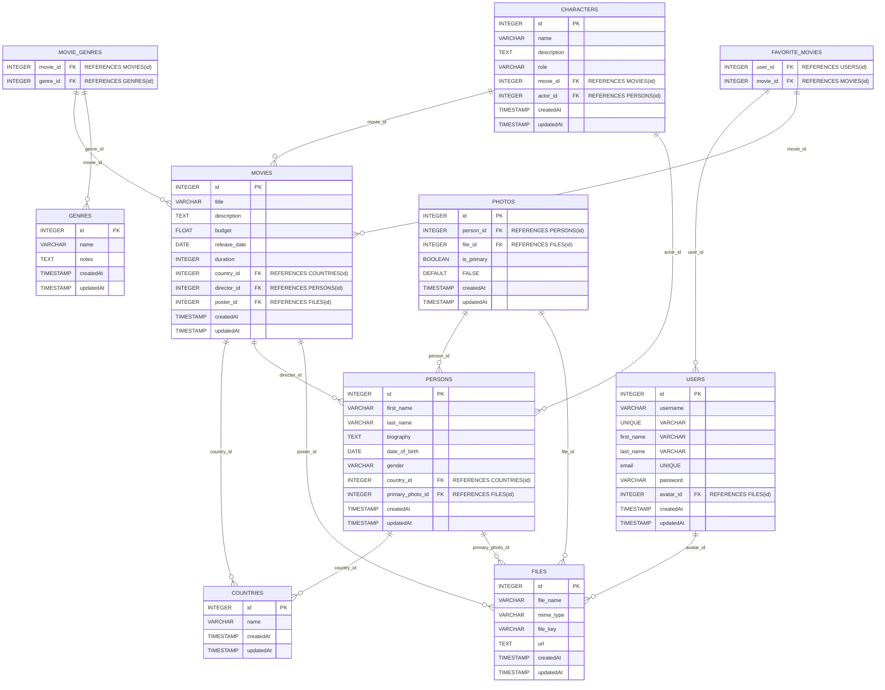

#Database structure

```mermaid
    erDiagram
    FILES {
        INTEGER id PK
        VARCHAR file_name
        VARCHAR mime_type
        VARCHAR file_key
        TEXT url
        TIMESTAMP createdAt
        TIMESTAMP updatedAt
    }

    COUNTRIES {
        INTEGER id PK
        VARCHAR name
        TIMESTAMP createdAt
        TIMESTAMP updatedAt
    }

    GENRES {
        INTEGER id PK
        VARCHAR name
        TEXT notes
        TIMESTAMP createdAt
        TIMESTAMP updatedAt
    }

    USERS {
        INTEGER id PK
        VARCHAR username UNIQUE
        VARCHAR first_name
        VARCHAR last_name
        VARCHAR email UNIQUE
        VARCHAR password
        INTEGER avatar_id FK "REFERENCES FILES(id)"
        TIMESTAMP createdAt
        TIMESTAMP updatedAt
    }

    PERSONS {
        INTEGER id PK
        VARCHAR first_name
        VARCHAR last_name
        TEXT biography
        DATE date_of_birth
        VARCHAR gender
        INTEGER country_id FK "REFERENCES COUNTRIES(id)"
        INTEGER primary_photo_id FK "REFERENCES FILES(id)"
        TIMESTAMP createdAt
        TIMESTAMP updatedAt
    }

    MOVIES {
        INTEGER id PK
        VARCHAR title
        TEXT description
        FLOAT budget
        DATE release_date
        INTEGER duration
        INTEGER country_id FK "REFERENCES COUNTRIES(id)"
        INTEGER director_id FK "REFERENCES PERSONS(id)"
        INTEGER poster_id FK "REFERENCES FILES(id)"
        TIMESTAMP createdAt
        TIMESTAMP updatedAt
    }

    CHARACTERS {
        INTEGER id PK
        VARCHAR name
        TEXT description
        VARCHAR role
        INTEGER movie_id FK "REFERENCES MOVIES(id)"
        INTEGER actor_id FK "REFERENCES PERSONS(id)"
        TIMESTAMP createdAt
        TIMESTAMP updatedAt
    }

    MOVIE_GENRES {
        INTEGER movie_id FK "REFERENCES MOVIES(id)"
        INTEGER genre_id FK "REFERENCES GENRES(id)"
    }

    FAVORITE_MOVIES {
        INTEGER user_id FK "REFERENCES USERS(id)"
        INTEGER movie_id FK "REFERENCES MOVIES(id)"
    }

    PHOTOS {
        INTEGER id PK
        INTEGER person_id FK "REFERENCES PERSONS(id)"
        INTEGER file_id FK "REFERENCES FILES(id)"
        BOOLEAN is_primary DEFAULT FALSE
        TIMESTAMP createdAt
        TIMESTAMP updatedAt
    }

    USERS ||--o{ FILES : "avatar_id"
    PERSONS ||--o{ COUNTRIES : "country_id"
    PERSONS ||--o{ FILES : "primary_photo_id"
    MOVIES ||--o{ COUNTRIES : "country_id"
    MOVIES ||--o{ PERSONS : "director_id"
    MOVIES ||--o{ FILES : "poster_id"
    CHARACTERS ||--o{ MOVIES : "movie_id"
    CHARACTERS ||--o{ PERSONS : "actor_id"
    MOVIE_GENRES ||--o{ MOVIES : "movie_id"
    MOVIE_GENRES ||--o{ GENRES : "genre_id"
    FAVORITE_MOVIES ||--o{ USERS : "user_id"
    FAVORITE_MOVIES ||--o{ MOVIES : "movie_id"
    PHOTOS ||--o{ PERSONS : "person_id"
    PHOTOS ||--o{ FILES : "file_id"
```
